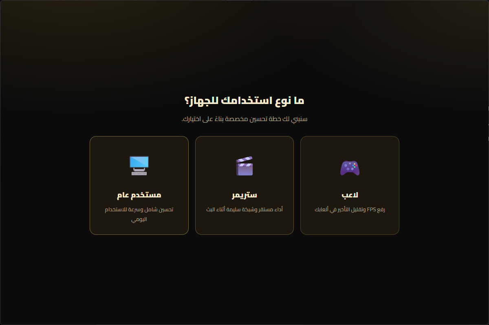
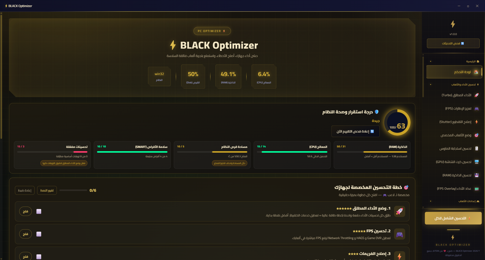

# ⚡ BLACK OPTIMIZER

**أداة تحسين ويندوز الشاملة — ارفع FPS، نظّف جهازك، أصلح النظام، وراقب كل شيء من واجهة سوداء/ذهبية فاخرة**

   

> ⚡ أداة واحدة. كل التحسينات. أقصى أداء. سيطرة كاملة على جهازك. 🎮🔥

> ✨ **رفع FPS حقيقي** • **تنظيف عميق** • **حماية من التلاعب** • **تحديث تلقائي** • **واجهة سوداء/ذهبية أنيقة** ✨

---

## 📖 عن الأداة

**BLACK OPTIMIZER** أداة متكاملة مبنية بتقنية Electron، تمنح اللاعبين والمستخدمين كل ما يحتاجونه لرفع **FPS**، وتنظيف الملفات المؤقتة، وإصلاح ويندوز، ومراقبة صحة أجهزتهم — كل ذلك من واجهة واحدة سوداء/ذهبية أنيقة وسهلة الاستخدام.

لا مزيد من التنقل بين 10 برامج مختلفة. هنا كل شيء... وأكثر. 🛠️⚡

---

## ✨ الميزات الرئيسية

### ⚡ الأداء والـ FPS

- **رفع FPS** — تعديلات الريجستري والعمليات بنقرة واحدة لرفع FPS
- **وضع الألعاب** — تركيز كل موارد النظام على لعبتك
- **منظف ذاكرة تلقائي** — يحافظ على الرام فاضيًا تلقائيًا
- **محسن الرام** — تنظيف يدوي للذاكرة عند الطلب
- **عداد FPS** — تابع FPS في اللعبة بشكل حي
- **ملفات FPS للألعاب** — حفظ وتحميل إعدادات الأداء لكل لعبة
- **محسن كرت الشاشة** — ضبط كرت الشاشة للألعاب
- **محسن SSD** — تعديلات لتسريع الهارد
- **خطط الطاقة** — إنشاء خطة طاقة مثالية للألعاب
- **المؤثرات البصرية** — تحسين مظهر ويندوز للسرعة
- **مصلح تأخير الإدخال** — تقليل زمن الاستجابة في الألعاب
- **تأخير الماوس** — تقليل زمن استجابة النقر والحركة
- **مصلح التقطيع** — التخلص من التقطيع المفاجئ

### 🧹 تنظيف الجهاز

- **منظف النظام** — إزالة الملفات المؤقتة والزبالة
- **تنظيف المتصفحات** — مسح الكاش من كل المتصفحات
- **محلل المساحة** — اكتشف ما الذي يشغل مساحة التخزين
- **مزيل البرامج المثبتة** — حذف التطبيقات المدمجة مع النظام
- **مدير بدء التشغيل** — تحكم بالبرامج التي تعمل مع الإقلاع
- **حذف التطبيقات** — إزالة البرامج المثبتة بشكل نظيف
- **حذف تطبيقات المتجر** — إزالة تطبيقات متجر ويندوز

### 🛠️ إصلاح النظام

- **إصلاح ويندوز** — SFC، DISM، إصلاح الريجستري وملفات DLL
- **إصلاح الإنترنت** — إعادة ضبط TCP/IP، Winsock، DNS وجدار الحماية
- **محسن الشبكة** — DNS، QoS وتعديلات TCP لتحسين البينق
- **توربو الشبكة** — أقصى سرعة للإنترنت
- **مانع تحديثات ويندوز** — تحكم كامل بالتحديثات
- **محلل الشاشة الزرقاء** — قراءة وفهم أعطال الشاشة الزرقاء
- **نقاط الاستعادة** — إنشاء واسترجاع نسخ احتياطية للنظام

### 🛡️ الأمان والخصوصية

- **مدير الحماية** — تحكم كامل في Windows Defender
- **تعديلات الخصوصية** — منع ويندوز من تتبعك
- **مدير الشبكة** — حظر الأجهزة المشبوهة من الواي فاي

### 🌐 الشبكات والمراقبة

- **فحص السرعة** — اختبر سرعة الإنترنت عندك
- **محلل الواي فاي** — افحص الشبكات القريبة وتفاصيلها
- **مراقب البينق** — قياس زمن الاستجابة لأي سيرفر
- **مراقب الشبكة** — الاتصالات الحية والإحصائيات
- **مراقب النظام** — أداء المعالج والرام اللحظي
- **مراقب الحرارة** — تابع حرارة المعالج وكرت الشاشة
- **مدير العمليات** — شاهد وتحكم بكل عملية شغالة
- **مدير الخدمات** — إدارة خدمات ويندوز
- **صحة الهارد** — فحص حالة الأقراص وبيانات SMART

### 🎮 إضافات الألعاب

- **إعدادات مسبقة للألعاب** — طبّق أفضل الإعدادات لكل لعبة
- **كاشف الألعاب الشامل** — Rockstar / Battle.net / Riot والمزيد

---

## 🛡️ الحماية

- **تحقق سلامة الكود (Integrity)** — فحص SHA-256 للملفات الأساسية عند الإقلاع وبشكل دوري
- **كشف التلاعب** — قفل تلقائي عند تعديل أي ملف محمي
- **كشف المُصححات (Debugger)** — رصد أدوات التطوير ومحاولات التنقيب
- **نظام ترخيص** — مفاتيح تفعيل مشفرة مع ربط الأجهزة وحد أقصى للأجهزة
- **تسجيل محاولات الاختراق** — رصد وحظر الأجهزة المخترقة

---

## 📥 تحميل وتثبيت

### الطريقة الأولى: التثبيت (مفضلة)

1. اذهب لصفحة **[Releases](https://github.com/ja7em505/BLACK-Optimizer/releases)**
2. حمّل آخر نسخة **`Black-Optimizer-Setup-*.exe`**
3. شغّل المثبت واتبع الخطوات ✅
4. افتح **BLACK OPTIMIZER** من سطح المكتب أو قائمة ابدأ

### الطريقة الثانية: التحديث التلقائي 🔄

الأداة تدعم التحديث التلقائي — الإصدارات الجديدة تثبّت نفسها عند الإغلاق. ابقَ دائمًا على أحدث نسخة!

> ⚠️ **ملاحظة:** Windows SmartScreen قد يظهر تحذيرًا لأن البرنامج غير موقّع. اضغط **"More info" → "Run anyway"** للمتابعة. البرنامج يعمل بصلاحيات المسؤول تلقائيًا.

---

## 📋 متطلبات التشغيل

| المتطلب | الحد الأدنى |
| --- | --- |
| 🖥️ النظام | Windows 10 / 11 (64-bit) |
| 🧠 الذاكرة | 4 GB |
| 💾 المساحة | 300 MB فاضي |
| 🌐 إنترنت | مطلوب للتحديثات والترخيص |

---

## 🙏 الدعم

- ⭐ اعمل Star للمستودع إذا عجبك!
- 🐛 لقيت خطأ؟ [افتح مشكلة](https://github.com/ja7em505/BLACK-Optimizer/issues)
- 💬 عندك اقتراح؟ حابين نسمعه!

---

## 📄 الترخيص

هذا البرنامج **ملكية خاصة (Proprietary)**. جميع الحقوق محفوظة © 2026 **JA7EM**.

لا يُسمح بنسخ أو تعديل أو إعادة توزيع الكود المصدري أو البرنامج دون إذن صريح.

---

**صُنع بكل ❤️ من [JA7EM](https://github.com/ja7em505)**

*العب بدون تقطيع... وسيطر على جهازك!* 🎮⚡🔥
